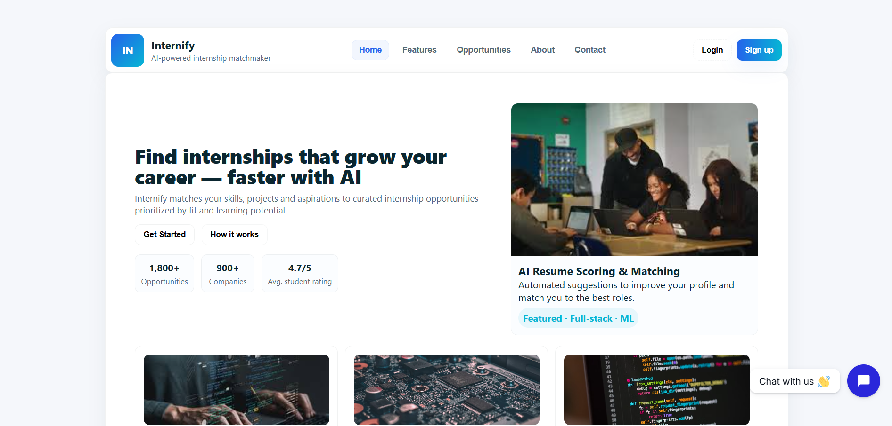
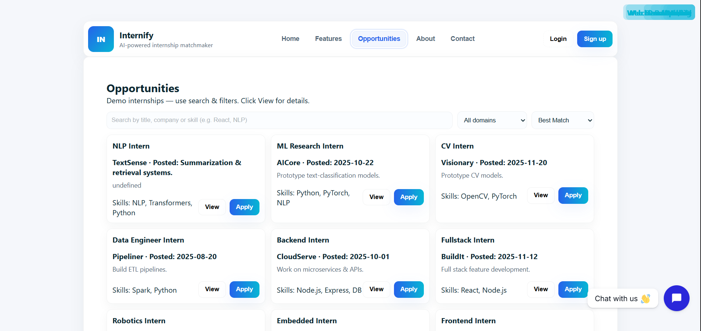
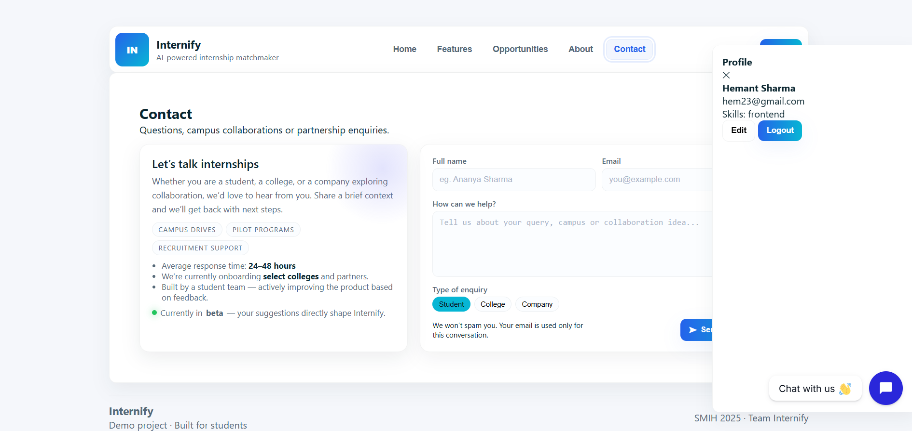

# 🌐 Internify – Internship Management Platform

Internify is a simple **full-stack web application** built to manage and explore internship opportunities.  
The project follows a clean backend architecture with a structured frontend, making it easy to understand and scale.


## 🖥️ Built With

- **JavaScript**
- **Node.js**
- **Express.js**
- **MongoDB**
- **HTML / CSS**


## 🎯 Features

- 📋 Internship data management
- 🔗 RESTful APIs using Express.js
- 🧩 MVC-based backend structure
- ⚙️ Middleware for request handling
- 🌐 Frontend connected with backend APIs

## 📂 Project Structure

```bash
Internify/
├── Frontend/               
├── config/                 
├── controllers/            
├── middleware/             
├── models/                 
├── routes/                 
├── server.js               
├── package.json
├── package-lock.json
└── README.md
```

## 🧠 How It Works
 1. The app presents one question at a time.
 2. The user selects an answer and clicks Next.
3. At the end, the app calculates and displays the score.
 4. Questions and answers are hardcoded or loaded from a file (if implemented).

## Screenshot





### 📬 Contact
Have any questions or want to connect?
Reach me here: 🔗 [Linktree](https://linktr.ee/hemantsharma22?fbclid=PAQ0xDSwLbT41leHRuA2FlbQIxMQABp6bFdMywhk2GzbSiCfWfDCb8gXvykT8vF0bZEOt6SykMrXjh5t9-hKWpy3Ak_aem_0I6JJKhw2812C9Gu80zg5A) - All My Links
